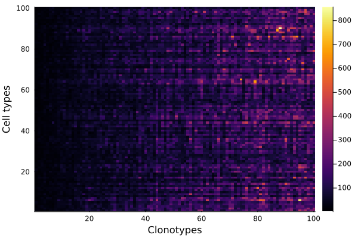
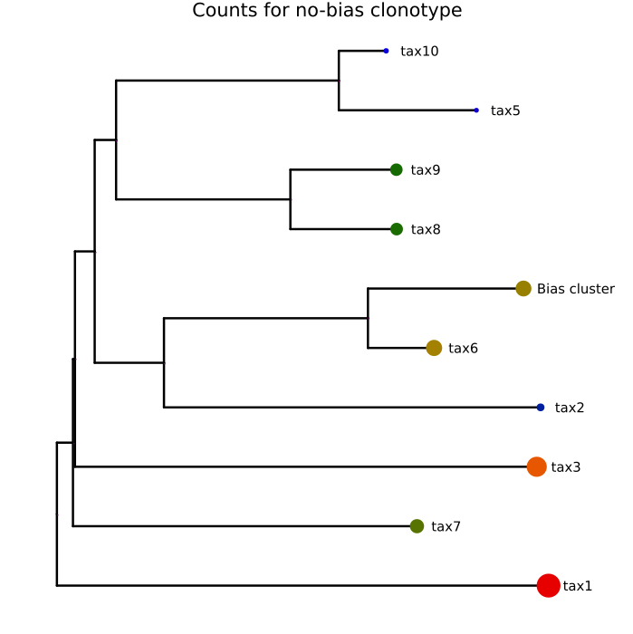
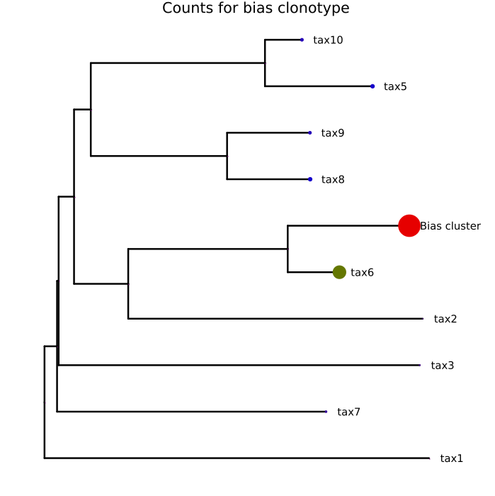

# Simple simulation
We model the log-domained count frequencies with Gaussian Brownian Motion (or w/e this is called)
```julia
using MolecularEvolution, Phylotrajectories, Phylo, Plots

n_cell_types = 100
n_clonotypes = 100
n_cells = 100 * n_cell_types * n_clonotypes
n(t) = (10*n_cell_types)/(1+exp(t-10))
tree = sim_tree(n_cell_types,n,n_cell_types/5, mutation_rate = 0.05)
initial_partition = GaussianPartition(0.0, 0.0)
simple_model = BrownianMotion(-0.3, 1.5)
cluster_names, count_matrix = sim_count_matrix(tree, n_clonotypes, n_cells, initial_partition, simple_model);
```

# Clonotype-wise simulation
We let the differentiation model differ between clonotypes
```julia
clonotype_wise_model = [BrownianMotion(-0.0 + log(1 + i), 0.2) for i = 1:n_clonotypes]
cluster_names, count_matrix = sim_count_matrix(tree, n_clonotypes, n_cells, initial_partition, clonotype_wise_model)
heatmap(count_matrix, xlabel="Clonotypes", ylabel="Cell types")
```


# Bias model
Here, we try to simulate the phenomenon of a clonotype "preferring" a certain cell type
```julia
n_cell_types = 10
n_clonotypes = 10
n_cells = 100 * n_cell_types * n_clonotypes
tree = sim_tree(n_cell_types,n,n_cell_types/5, mutation_rate = 0.05)
ladderize!(tree)
bias_clonotype = 3
nobias_clonotype = 7
towards_cluster = 5
pos_bias_model = BrownianMotion(3.0, 1.5)
neg_bias_model = BrownianMotion(-4.5, 1.5)
function bias_model(i)
    if i != bias_clonotype
        return simple_model
    end
    bias_branches = Set(Phylotrajectories.getnode2rootpath(getleaflist(tree)[towards_cluster]))
    d = Dict{FelNode, BrownianMotion}()
    for n in getnodelist(tree)
        if n ∈ bias_branches
            d[n] = pos_bias_model
        else
            d[n] = neg_bias_model
        end
    end
    return n::FelNode -> [d[n]]
end

cluster_names, count_matrix = sim_count_matrix(tree, n_clonotypes, n_cells, initial_partition, bias_model);
```
At each leaf, we store the square root of the counts for two different clonotypes (bias/no-bias)
> [!NOTE]  
> We take the square root to transform an area (counts of cells) to a radius (`markersize` in plots)
```julia
i = 1
for n in getnodelist(tree)
    if isleafnode(n)
        n.node_data = Dict("bias_count" => sqrt(count_matrix[i, bias_clonotype]),
                           "nobias_count" => sqrt(count_matrix[i, nobias_clonotype]))
        i += 1
    else
        n.node_data = Dict("bias_count" => 0,
                           "nobias_count" => 0)
    end
end
```
Now, we plot the tree for the two different clonotypes with a count overlay
```julia
getleaflist(tree)[towards_cluster].name = "Bias cluster"

phylo_tree = get_phylo_tree(tree)

plot(phylo_tree, 
    showtips = true, 
    tipfont = 10, 
    markerstrokewidth = 0,
    linewidth = 2.5, 
    marker_z = "nobias_count",
    markersize = values_from_phylo_tree(phylo_tree,"nobias_count"), 
    markercolor = :darkrainbow,
    size = (700, 700), 
    colorbar = false,
    title="Counts for no-bias clonotype")
```

```julia
plot(phylo_tree, 
    showtips = true, 
    tipfont = 10, 
    markerstrokewidth = 0,
    linewidth = 2.5, 
    marker_z = "bias_count",
    markersize = values_from_phylo_tree(phylo_tree,"bias_count"), 
    markercolor = :darkrainbow,
    size = (700, 700), 
    colorbar = false,
    title="Counts for bias clonotype")
```
